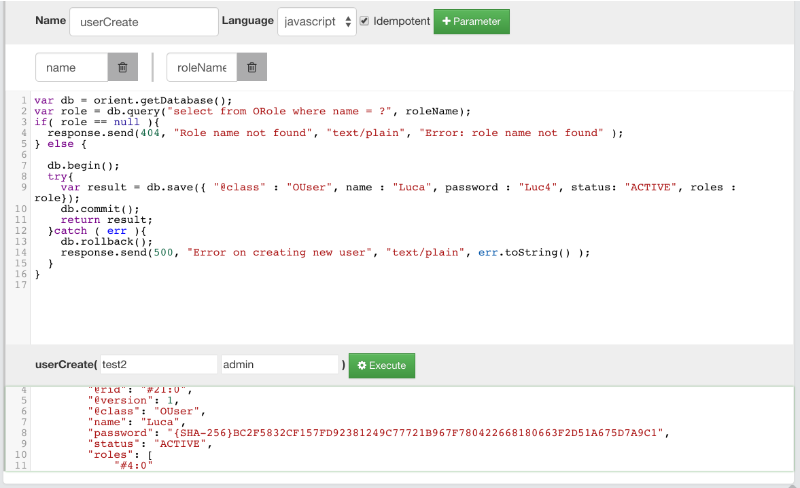

# Accessing the Database from a Function

When you create a function for OrientDB, it always binds the special variable `orient` to allow you to use OrientDB services from within the function.  The most important methods are:

| Function | Description |
|---|---|
| `orient.getDatabase()` | Returns the current [document database](http://www.orientechnologies.com/javadoc/latest/com/orientechnologies/orient/core/db/document/ODatabaseDocumentTx.html) instance. |


For security reason starting from *OrientDB 3.0.29*, the usage of Java classes is forbidden by default, with a class filter implemented in the JS engine.
To enable the access to classes or packages in your JS code change the `allowedPackages` field with comma separated packages or classes.

```xml
  <handler class="com.orientechnologies.orient.server.handler.OServerSideScriptInterpreter">
    <parameters>
      <parameter name="enabled" value="true" />
      <parameter name="allowedLanguages" value="SQL" />
       <!--  Comma separated packages  allowed in JS scripts eg. java.math.*, java.util.ArrayList -->
      <parameter name="allowedPackages" value=""/>
    </parameters>
  </handler>
```

## Executing Queries

Queries are idempotent commands.  To execute a query from within a function, use the `query()` method.  For instance,

  ```javascript
  return orient.getDatabase().query("SELECT name FROM OUser");
  ```

### Queries with External Parameters

Create a new function with the name `getUserRoles` with the parameter `user`.  Then use this code:

  ```javascript
  return orient.getDatabase().query("SELECT roles FROM OUser WHERE name = ?", name );
  ```

  Here, the function binds the `name` parameter as a variable in JavaScript.  You can use this variable to build your query.


### SQL Commands

Execute an SQL command within the function:

```javascript
var results = orient.getDatabase().command("SELECT FROM Employee WHERE company = ?", [ "Orient Technologies" ] );
```

The command returns an array of [`OElement`](../java/ref/OElement.md) objects


## Creating Repository Classes

Functions provide an ideal place for developing the logic your application uses to access the database.  You can adopt a [Domain-driven design](http://en.wikipedia.org/wiki/Domain-driven_design) approach, allowing the function to work as a [repository](http://en.wikipedia.org/wiki/Domain-drven_design#Building_blocks_of_DDD) or as a [Data Access Object](http://en.wikipedia.org/wiki/Data_access_object).

This provides a thin (or thick, if you prefer) layer of encapsulation which may protect you from database changes.

Furthermore, each function is published and reachable via the HTTP REST protocol, allowing the automatic creation of a RESTful service.

**Examples**

Below are some examples of functions to build a repository for `OUser` records:

```javascript
function user_getAll() {
   return orient.getDatabase().query("SELECT FROM OUser");
}

function user_getByName( name ){
   return orient.getDatabase().query("SELECT FROM OUser WHERE name = ?", name );
}

function user_getAdmin(){
   return user_getByName("admin");
}
 
function user_create( name, role ){
   var db = orient.getDatabase();
   var role = db.query("SELECT FROM ORole WHERE name = ?", roleName);
   if( role == null ){
      response.send(404, "Role name not found", "text/plain", "Error: role name not found" );
   } else {

      db.begin();
      try{
         var result = db.save({ "@class" : "OUser", name : "Luca", password : "Luc4", status: "ACTIVE", roles : role});
         db.commit();
         return result;
      }catch ( err ){
         db.rollback()
         response.send(500, "Error on creating new user", "text/plain", err.toString() );
      }
   }
}
```



