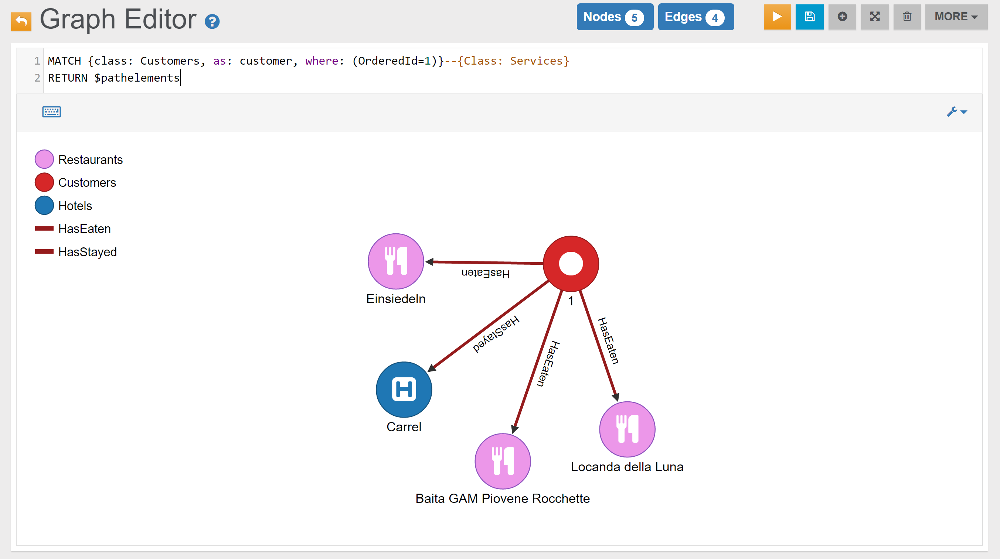
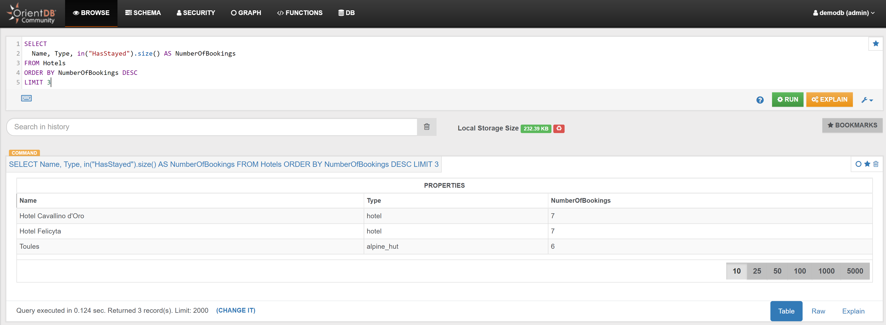
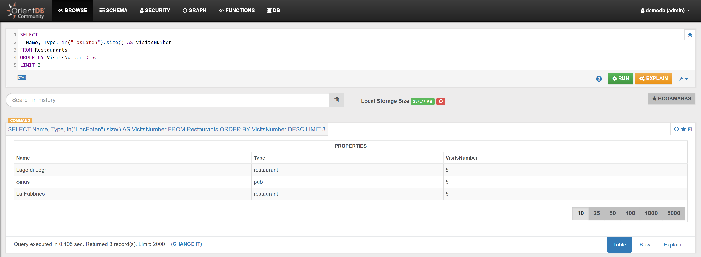
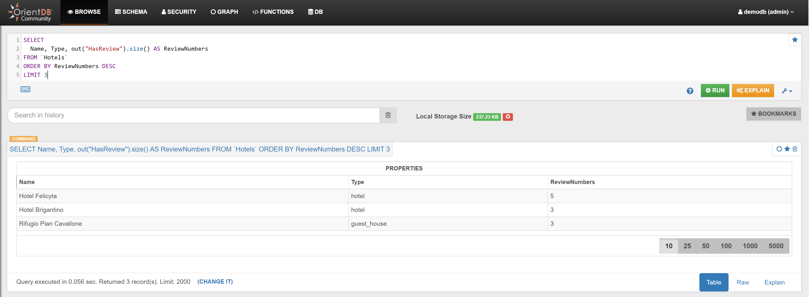
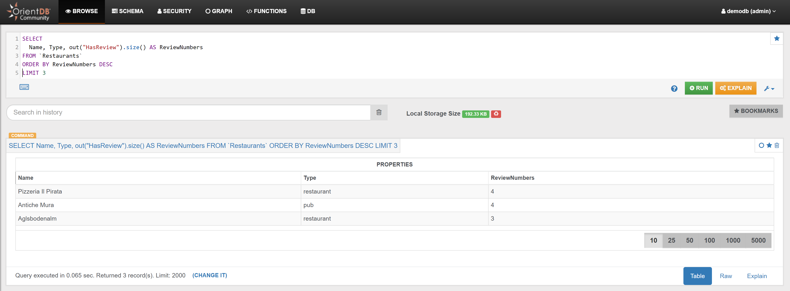
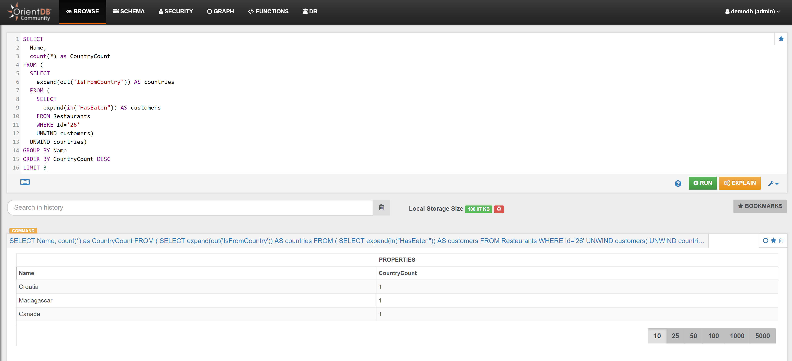
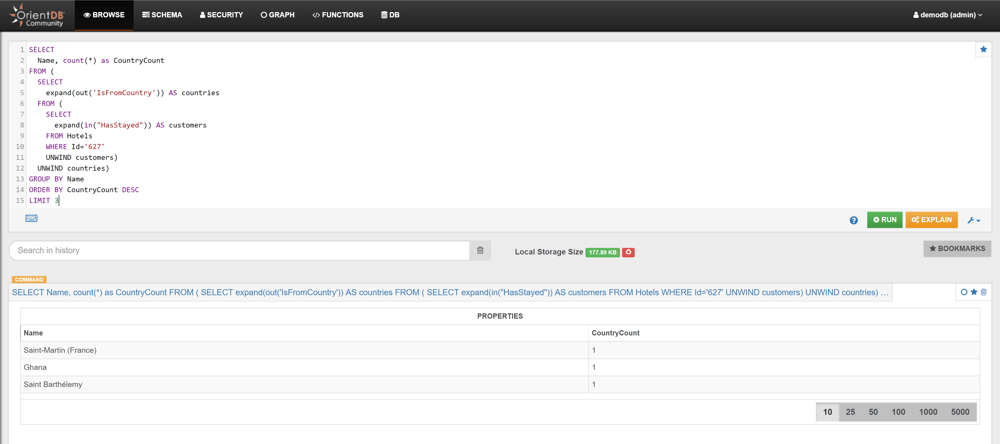

# Services 

## Example 1

Find all Services connected with Customer with OrderedId 1:

```sql
MATCH {class: Customers, as: customer, where: (OrderedId=1)}--{Class: Services, as: service}
RETURN $pathelements
```

In the _Graph Editor_ included in [Studio](../../../studio/README.md), using _'RETURN $pathelements'_ as `RETURN` clause, this is the obtained graph:



In the _Browse Tab_ of [Studio](../../../studio/README.md), using _'RETURN service.@Rid as Service_RID, service.Name as Service_Name, service.Type as Service_Type'_ as `RETURN` clause, this is the obtained list of records (only few records are shown in the image below):


## Example 2

Find the 3 Hotels that have been booked most times:

```sql
SELECT 
  Name, Type, in("HasStayed").size() AS NumberOfBookings 
FROM Hotels 
ORDER BY NumberOfBookings DESC 
LIMIT 3
```

In the _Browse Tab_ of [Studio](../../../studio/README.md), using the query below, this is the obtained list of records:



In a similar way:

Find the 3 Restaurants that have been used most times:

```sql
SELECT 
  Name, Type, in("HasEaten").size() AS VisitsNumber 
FROM Restaurants 
ORDER BY VisitsNumber DESC 
LIMIT 3
```

In the _Browse Tab_ of [Studio](../../../studio/README.md), using the query below, this is the obtained list of records:




## Example 3

Find the 3 Hotels that have most reviews: 

```sql
SELECT 
  Name, Type, out("HasReview").size() AS ReviewNumbers 
FROM `Hotels` 
ORDER BY ReviewNumbers DESC 
LIMIT 3
```

In the _Browse Tab_ of [Studio](../../../studio/README.md), using the query below, this is the obtained list of records:



In a similar way:

Find the 3 Restaurants that have most reviews :

```sql
SELECT 
  Name, Type, out("HasReview").size() AS ReviewNumbers 
FROM `Restaurants` 
ORDER BY ReviewNumbers DESC 
LIMIT 3
```

In the _Browse Tab_ of [Studio](../../../studio/README.md), using the query below, this is the obtained list of records:




## Example 4

Find the top 3 nationality of the tourists that have eaten at Restaurant with Id 26:

```sql
SELECT 
  Name, 
  count(*) as CountryCount 
FROM (
  SELECT 
    expand(out('IsFromCountry')) AS countries 
  FROM (
    SELECT 
      expand(in("HasEaten")) AS customers 
    FROM Restaurants 
    WHERE Id='26' 
    UNWIND customers) 
  UNWIND countries) 
GROUP BY Name 
ORDER BY CountryCount DESC 
LIMIT 3
```

In the _Browse Tab_ of [Studio](../../../studio/README.md), using the query below, this is the obtained list of records:



In a similar way:

Find the top 3 nationality of the tourists that stayed at Hotel with Id 627:

```sql
SELECT 
  Name, count(*) as CountryCount 
FROM (
  SELECT 
    expand(out('IsFromCountry')) AS countries 
  FROM (
    SELECT 
      expand(in("HasStayed")) AS customers 
    FROM Hotels 
    WHERE Id='627' 
    UNWIND customers) 
  UNWIND countries) 
GROUP BY Name 
ORDER BY CountryCount DESC 
LIMIT 3
```

In the _Browse Tab_ of [Studio](../../../studio/README.md), using the query below, this is the obtained list of records:


